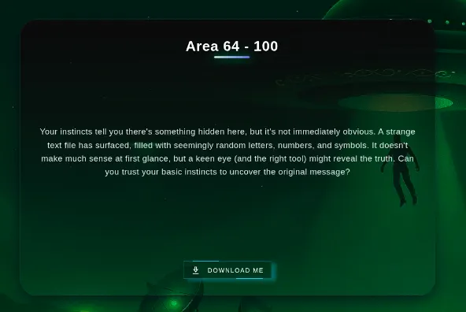
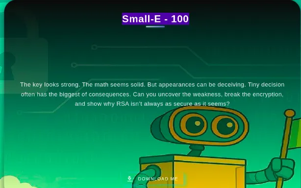
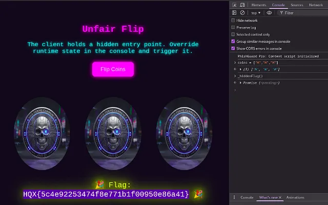
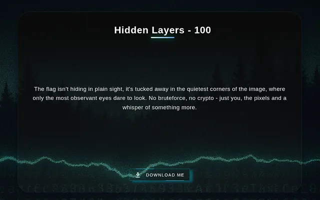
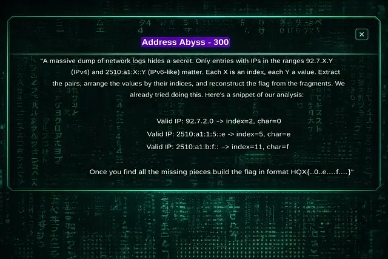
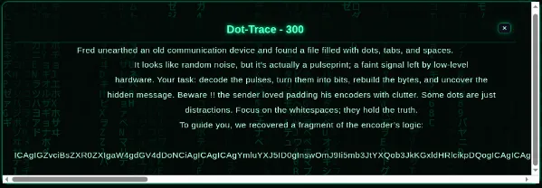

Every year, TCS organizes HackQuest, an ethical hacking and cybersecurity competition for students across India. Designed in a Capture the Flag (CTF) format, the event challenges participants to solve security-based tasks and uncover hidden flags. High-performing participants earn prizes and may also receive opportunities to join TCS’s Cyber Security Unit.


TCS HackQuest follows a three-round structure:
Round 1 is an online Capture the Flag (CTF) with beginner to expert challenges; shortlisted participants move to -
Round 2, an online, remotely proctored advanced challenge requiring cameras on;
the Final round is an in-person event at a TCS location, culminating in potential job offers for top performers, all focused on ethical hacking skills.

One tip I’d suggest is to write your report alongside solving challenges, as I did. This way, you won’t miss important steps or details later on. It helps you stay organized and ensures you capture all the relevant information while it’s still fresh.

There were a total of 10+ challenges, each worth 100, 300, or 500 points. I was able to fully solve the 10 challenges. Let me walk through my report.

1. Area 64 - HQX{70c5d525ca8e13c516df97a49bf4ccf8}
2. Small E - HQX{36b868296653f3a768c8623f687a77ff}
3. Unfair Flip - HQX{5c4e92253474f8e771b1f00950e86a41}
4. Refresh Ritual - HQX{334fe20f2594ff6e9d39c20c5412d3dc} 
5. Hidden layers - HQX{24c0ce09e05799839a51d9439d1d48f0}
6. Know Meh Better - HQX{248329653309ff82036fd49245401d74}
7. Synthetic Stacks - HQX{df30cb178ebaad2dd3820d3e6551c8de}
8. Address Abyss - HQX{e1f63411d0d0ad58a87b08bb0860d9f4}
9. Dot Trace - HQX{ba44805fbe2eaafebf4a58acb2af175e} 
10. Fast and Rebound - HQX{f37052426c34cb4a11444781c7aebf3b}


## #01. Area 64 (100) 
```
Flag : HQX{70c5d525ca8e13c516df97a49bf4ccf8}
```



### Steps:
1. The provided file contained a base64 encoded text (from the name area 64)
2. Decrypt the base64 encoded text:
    ```
	$ echo <b64 text> | base64 –decode
    ```
3. It prints the flag.

## #02. The Small E (100)
```
Flag : HQX{36b868296653f3a768c8623f687a77ff}
```



### Steps:
1. The given python file had the values of N, e, c. which are enough to do a small e attack.
2. Since the value of e is small, i.e., 3, the plaintext can be obtained simply by calculating the cube root of ciphertext.
3. This is because when e is small and pt is small enough, pt^e mod N will still be pt^e if pt^e is smaller than the modulus N.
4. So pt can be obtained by gmpy2.iroot(c, 3) which gives the flag.

## #03. Unfair Flip (100)
```
Flag:  HQX{5c4e92253474f8e771b1f00950e86a41}
```



### Steps: 
1. The script simply stored the values of coins in window.coins.
2. It can be manipulated from the console.
3. Window.coins = [‘H’, ‘H’, ‘H’] sets all the coins to heads.
4. There was another called _hiddenFlag()
5. Calling window._hiddenFlag() gives the flag.

## #04.Refresh Rituals (100)
```
Flag:  HQX{334fe20f2594ff6e9d39c20c5412d3dc}
```

### Steps: 

1. This website simply refreshes every 3 seconds or so.
2. At each refresh, a new password will be generated for the admin to login.
3. So I have written a python script to get the hint and login as admin.
4. Script:

```
import requests
import re

URL = "http://challenge.tcshackquest.com:12138/"

# Create a session to preserve cookies
session = requests.Session()

# STEP 1: Initial GET (generate password + session)
resp = session.get(URL)
html = resp.text

# Extract Hint value
match = re.search(r'Hint="([a-f0-9]+)"', html)
if not match:
print("[-] Hint not found")
exit(1)

password = match.group(1)
print(f"[+] Extracted password hint: {password}")

# STEP 2: POST using same session
data = {
"username": "admin",
"password": password
}

resp = session.post(URL, data=data)

print("\n[+] Server Response:\n")
print(resp.text)
```

This prints the flag:
Login successful! Welcome, Admin! HQX{334fe20f2594ff6e9d39c20c5412d3dc}

## #05.Hidden Layers (100)
```
Flag:  HQX{24c0ce09e05799839a51d9439d1d48f0}
```



### Steps: 

1. This had a image provided. From the description, it said pixels so I tried using LSB steganography and it worked.

Try rgb sequential bits:

```
bits=[] for pixel in arr.reshape(-1,3): bits.append(pixel[0]&1) bits.append(pixel[1]&1) bits.append(pixel[2]&1)
bits=bits[:len(bits)//8*8] bytes_vals=[int(''.join(map(str,bits[i:i+8])),2) for i in range(0,len(bits),8)] msg=''.join(chr(b) if 32<=b<=126 else '.' for b in bytes_vals) msg[:300]
```

Output: 
```
'HQX{24c0ce09e05799839a51d9439d1d48f0}..I$...m..mm..m..m..m..m..m..m..m..m..m..m...I$.I$m..I$...mI$.I$.I$.I$.$.I.m..m..m..m..m..m.$.I$.I$.I$.I$.I$.I$.I.m..m..m..m..m..m.$.I$.I$.I$.II$.I$...m..mm..m..m..m..m..m..m..m..m..m..m...I$.I$m..I$...mI$.I$.I$.I$.$.I.m..m..m..m..m..m.$.I$.I$.I$.I$.I$.I$.I.m..m.'
```

## #06.Know Meh Better (300)
```
Flag: HQX{248329653309ff82036fd49245401d74}
```

### Steps: 
1. The file given is a python exe compiled file. So i decrypted the exe using pydecryptor and got the pyc file.
2. Then converted this pyc file to py file.
3. Reverse engineering the logic gives the flag.


## #07.Synthetic Stacks (300)
```
Flag:  HQX{df30cb178ebaad2dd3820d3e6551c8de}
```

### Steps: 
1. This provided a 7z file which had a password.
2. So i use john to cract the 7z file with the wordlist rockyou.txt.
3. Then I found a txt file, which looked like a qr code.
4. I converted it to a qr code and scanned it. It gave the flag.


## #08.Address Abyss (300)
```
Flag:  HQX{e1f63411d0d0ad58a87b08bb0860d9f4}
```



### Steps: 
1. Hidden data is encoded inside specific IP address formats.
 The task is filter → extract → order → reconstruct
2. Only IPs in:
3. 92.7.X.Y (IPv4)
4. 2510:a1:X::Y (IPv6-like)
5. X = index
6. Y = value (fragment)
    1. IPv4:
    Index = X, 
    Value = Y (decimal)
    2. IPv6:
    Index = X (hex → decimal), 
    Value = Y (hex digit)
    

Apply the challenge logic then:

HQX{first_32_hex_chars}
Is the flag!!

## #09.Dot Trace (300)
```
Flag:  HQX{ba44805fbe2eaafebf4a58acb2af175e}
```



### Steps: 
1.	This was like a whitespace cipher.
2.	The dots were just noise.
3.	The tabs \t were 1s and spaces were 0s.
4.	I converted them into ASCII and got the flag.


## #10.Fast and Rebound (500)
```
Flag: HQX{f37052426c34cb4a11444781c7aebf3b}
```

### Steps: 
1.	From the name, I got a hint of DNS rebinding and tried it. It gave the flag successfully.


