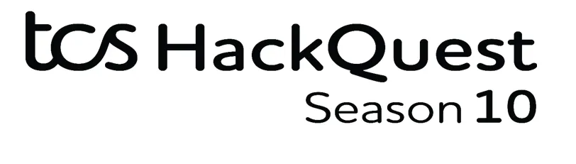
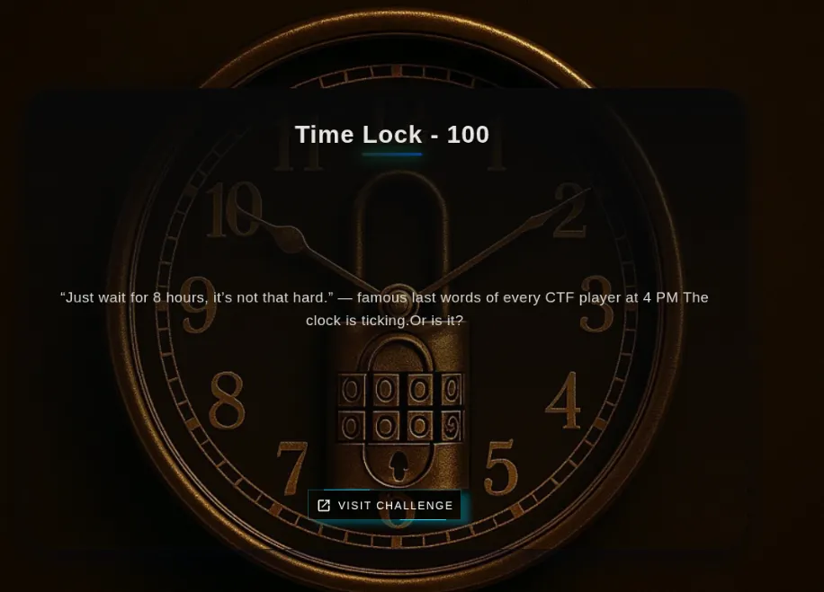
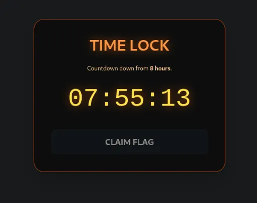
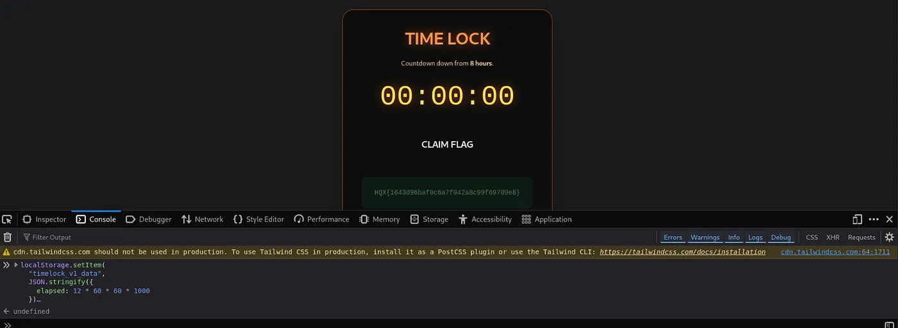
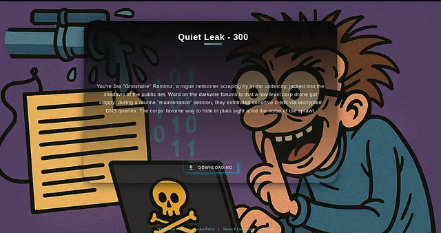
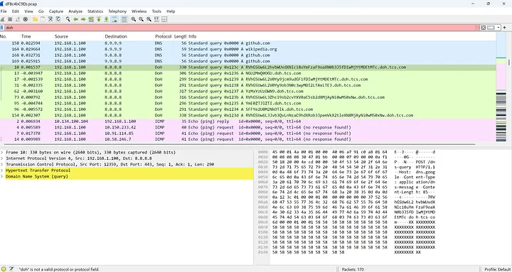
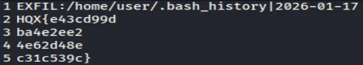
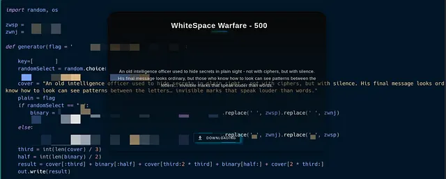
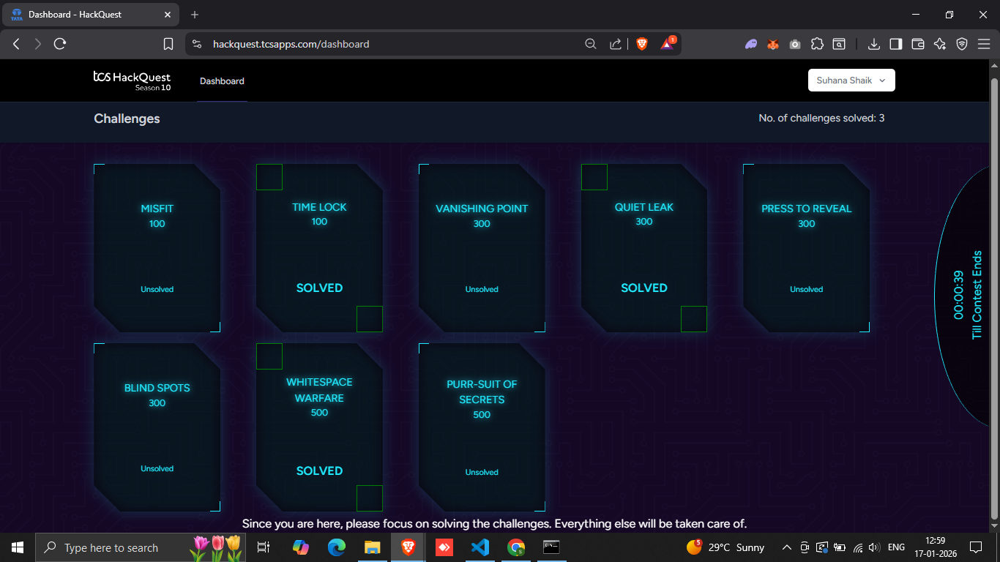

This is my complete walkthrough of the CTF challenges in Round 2.

After 3 weeks of completion of Round 1, I received an email with this Subject: Congratulations, you’ve made it to Round 2 of TCS HackQuest Season 10!

So this was a Proctored Round and used two platforms: TCS iON for proctoring (camera, screen sharing, and 360° room capture) and the TCS HackQuest platform for the CTF challenges. We had to stay logged in to TCS iON and TCS HackQuest on separate browser window/tab during the entire course of the assessment.

## The Challenges
There were a total of 8 challenges, each worth 100, 300, or 500 points.
Lets get started!

## Time Lock (100 points)



So there was this 8 hr Timer, and only when the Time had passed 8 hrs and reached 00:00:00 we can claim the Flag.



When I went through the JS Code, I found this snippet:

```
const REQUIRED_TIME = 8 * 60 * 60 * 1000;       // 8 hours
const CLAIM_WINDOW_START = 12 * 60 * 60 * 1000; // 12 hours
const CLAIM_WINDOW_END   = 13 * 60 * 60 * 1000; // 13 hours
```
Time tracking is stored in localStorage and Claim Window is accessible only if elapsed Time is ≥ 12 and ≤ 13 hrs.

So I open Devtools → Console and Set the Elapsed Time to 12 hours exactly using localStorage.setItem

```
localStorage.setItem(
  "timelock_v1_data",
  JSON.stringify({
    elapsed: 12 * 60 * 60 * 1000
  })
);
```

And there you go, First flag of the Day!



## #3: Quiet Leak (300 points)
The challenge presented a clue along with a .pcap file.


Fired up Wireshark to load the .pcap file. Upon studying the traffic logs, it was evident that the challenge had something to do with the DoH (DNS over HTTPS) traffic, since each log was a query to a TCS subdomain that consisted of a Base64 encoded subdomain name.



Decode the Base64 encode subdomain names and found a few of them to be fragments of the flag.
Press enter or click to view image in full size



These fragments are combined to form the flag and submitted it.


## #4: Whitespace Warfare (500 points)
Whitespace Warfare was a classic Unicode steganography challenge where the secret wasn’t embedded in visible text but concealed within invisible Unicode characters. At first glance, the provided text file appeared perfectly normal; however, the hint referencing “silence” clearly pointed toward the use of zero-width characters as the hidden data carrier.



Step 1: Read the File Properly

The script reads the file using UTF-8 encoding so that invisible characters are not lost.

Step 2: Find the Hidden Characters

The file looks normal, but it secretly contains zero-width characters.
Thus only the following need to be kept in the file:

Zero Width Space (U+200B)
Zero Width Non-Joiner (U+200C)
Everything else must be ignored.

Step 3: Turn Hidden Characters into Binary

Each invisible character represents a bit:

U+200B = 1
U+200C = 0
This converts the hidden data into a long binary string.

Step 4: Convert Binary to Text

The binary string is split into 8-bit chunks, and each chunk is converted into a normal ASCII character.

Step 5: Get the Flag

All decoded characters are joined together to reveal the hidden flag.

Time was of the essence, so quickly generated a Powershell script using ChatGPT to automate this task.

Powershell script:

```
# =========================================
# HQX Zero-Width Stego Decoder
# Reads a text file and extracts hidden flag
# =========================================

# Path to the file
$filePath = “04Ad2044c0.txt”

# Step 1: Read file as UTF-8
$text = Get-Content $filePath -Raw -Encoding UTF8

# Step 2: Extract only zero-width characters (U+200B and U+200C)
$zw = ($text.ToCharArray() | Where-Object {
 [int]$_ -eq 0x200B -or [int]$_ -eq 0x200C
}) -join ‘’

# Step 3: Convert zero-width chars to binary
# Correct mapping for this file: 200B -> 1, 200C -> 0
$bin = ($zw.ToCharArray() | ForEach-Object {
 if ([int]$_ -eq 0x200B) { ‘1’ }
 elseif ([int]$_ -eq 0x200C) { ‘0’ }
}) -join ‘’

# Step 4: Split binary into 8-bit chunks and convert to ASCII characters
$flagChars = ($bin -split ‘(.{8})’ | Where-Object { $_ }) | ForEach-Object {
 [char][Convert]::ToInt32($_, 2)
}

# Step 5: Join characters to form the final flag
$flag = -join $flagChars

# Step 6: Print the flag
Write-Output “Hidden Flag: $flag”
```



These were the challenges that I could solve in the Round 2 of TCS HackQuest Season 10!