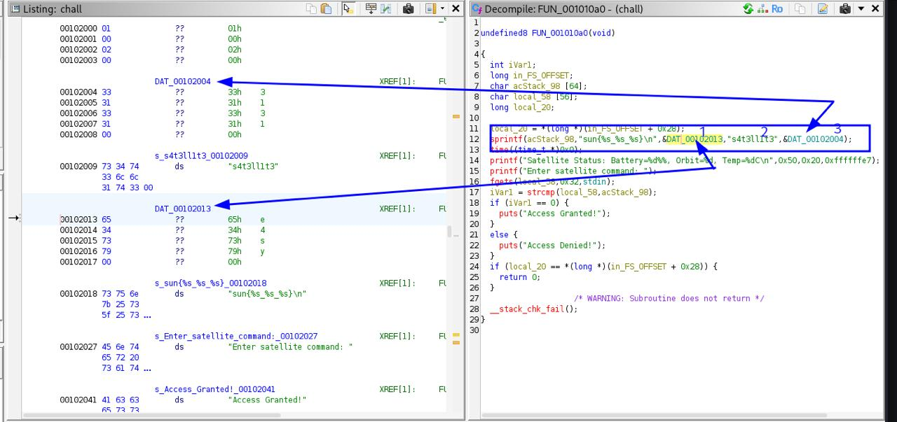

*Category:* Reverse / Binary   
*Platform:* ELF x86_64 (PIE, stripped)

*Description*: Ground Control to Space Cadet!

We've intercepted a satellite control program but can't crack the authentication sequence. The satellite is in an optimal transmission window and ready to accept commands.  
Your mission: Reverse engineer the binary and find the secret command to gain access to the satellite systems.

## Steps (as provided)

### 1. Check file type
bash
file chall

*Output*
text
chall: ELF 64-bit LSB pie executable, x86-64, version 1 (SYSV), dynamically linked, interpreter /lib64/ld-linux-x86-64.so.2, BuildID[sha1]=643f888f6a846b88e61a61a180506277b41c610d, for GNU/Linux 4.4.0, stripped

*Explanation:* verify binary format and note that it is stripped PIE.

### 2. Make executable and run (first trial)
bash
chmod +x ./chall
./chall

*Output*
text
Satellite Status: Battery=80%, Orbit=32, Temp=-25C
Enter satellite command: 1234
Access Denied!

*Explanation:* test the program behavior and confirm it prompts for a command.

### 3. Extract printable strings
bash
strings chall

*Notable output*
text
...
3131
s4t3ll1t3
e4sy
sun{%s_%s_%s}
Enter satellite command:
Access Granted!
Access Denied!
Satellite Status: Battery=%d%%, Orbit=%d, Temp=%dC
...

*Explanation:* find static strings and a format template that reveal the flag parts.

### 4. Open in Ghidra
bash
ghidra

### 5. Run and provide the discovered flag
bash
./chall

*Interaction / Input*

Satellite Status: Battery=80%, Orbit=32, Temp=-25C
Enter satellite command: sun{e4sy_s4t3ll1t3_3131}
Access Granted!

*Explanation:* supplying the constructed flag from the discovered fragments grants access.

## Flag

sun{e4sy_s4t3ll1t3_3131}